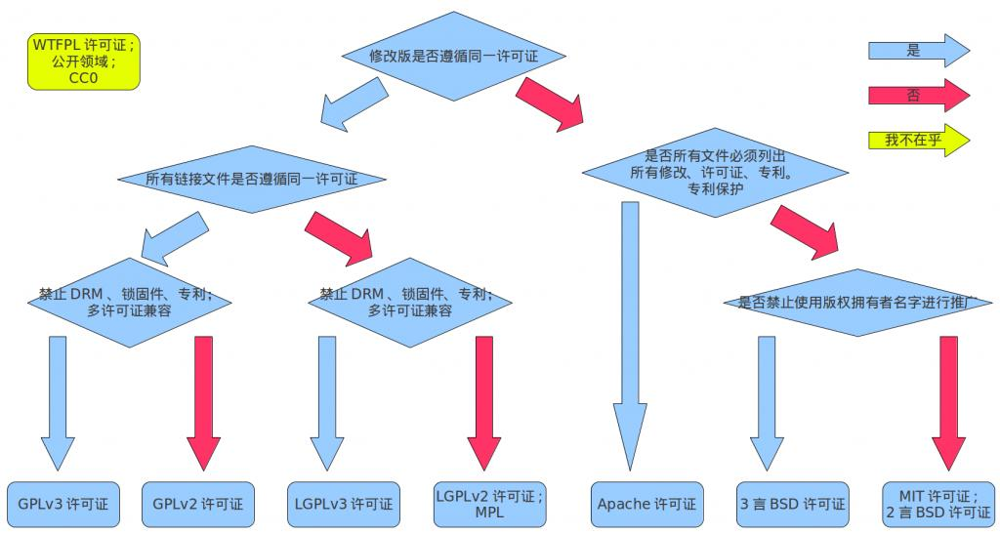

#License简介
之所以拿License当开篇，是因为开始在构思这个东西的时候，看了一下别人是如何搞这么个东西的，发现每个人在写文章的时候，都有这个东西。而我在工作过程中也借鉴过不少开源项目，对于Apache License可谓是在熟悉不过了，可是转念一想，我真的熟悉Apache License嘛？好像只是混个眼熟而已吧！License是个什么东西？它有什么作用？为什么要使用License?貌似一个也答不上来！

于是乎，在网上搜罗了半天，也算是明白了个大概。其中我认为有一篇文章介绍的比较通俗易懂，可以参见[开源类软件许可证简明指南](http://article.yeeyan.org/view/centaurtek/97224)。

在众多的License的中，MIT貌似是最宽松的，也是目前统计在github上使用最多的，对于技术分享类以及设计类中，使用CC貌似是最多的，在我所参考的其他人的技术分享中大多都是采用的CC的组合许可。但是，最终我选择了[WTFPL许可](http://www.wtfpl.net/txt/copying/)，因为我感觉这太TM符合我的性格了！   

另外下面这两张图也非常简单的区分出了各种License的区别:   

   
   

